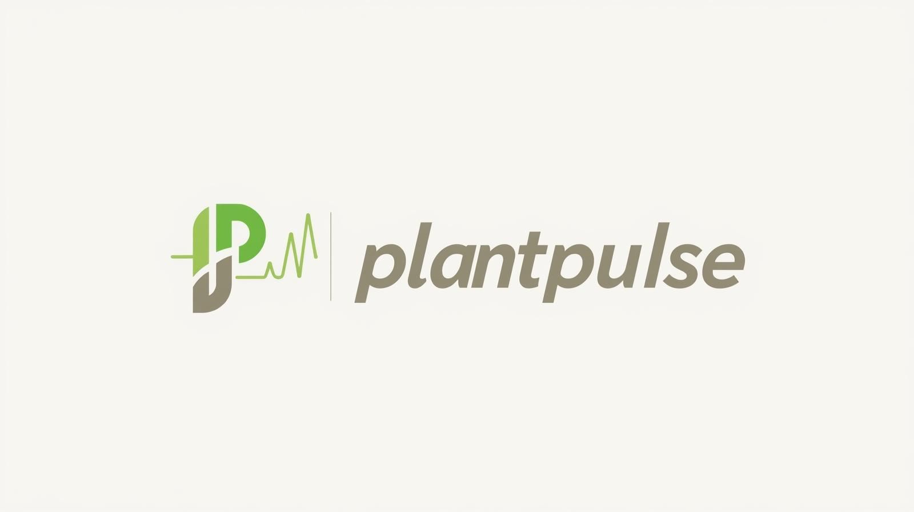

# PlantPulse-2.0

  

PlantPulse is a smart plant-monitoring system designed to help home growers and plant parents understand their plant’s needs in real time. Using an ESP32 microcontroller and three sensors (soil moisture, light, and temperature/humidity), the system collects environmental data and sends it to a custom web dashboard. The goal is to make plant care simple, clear, and based on real information so people can understand what their plants need.

 System Overview
PlantPulse collects environmental data from three sensors, sends it to an ESP32, and displays it on a lightweight web dashboard. Users interpret the data and take positive care actions.
Sensors → ESP32 → Web Dashboard → User → Care Action

##  Features (Current)

### ✔ Real-time environment monitoring
- Soil Moisture Sensor (V1.2)  
- DHT22 Temperature & Humidity Sensor  
- GL5516 LDR Light Sensor  

### ✔ ESP32 firmware
- Reads, processes, and formats sensor data  
- Sends values to the dashboard  
- Ready for future data-logging expansion  

### ✔ Web dashboard (HTML/CSS/JS)
- Displays moisture %, temperature, humidity, and light level  
- Clean UI built from scratch  
- Ready for calibration tuning and visual improvements  

### ✔ Documentation
- Agile reports  
- Iteration planning  
- System diagram  
- Organized, professional project structure

  ##  Tech Stack

### **Hardware**
- **ESP32-WROOM-32** — main microcontroller  
- **DHT22** — temperature & humidity sensor  
- **GL5516 LDR** — light sensor  
- **Capacitive Soil Moisture Sensor v1.2** — moisture measurement  
- **USB-to-Data Cable** — for flashing + power  
- **Breadboard & jumper wires** — prototyping setup  

---

### **Software**
- **Arduino IDE** — writing and uploading ESP32 firmware  
- **PlatformIO** (optional) — advanced embedded development  
- **HTML / CSS / JavaScript** — web interface for dashboard  
- **Git & GitHub** — version control and project organization  
- **Figma** — UI/UX design and diagrams  
- **Google Docs** — reports, iteration plans, and project documentation  

